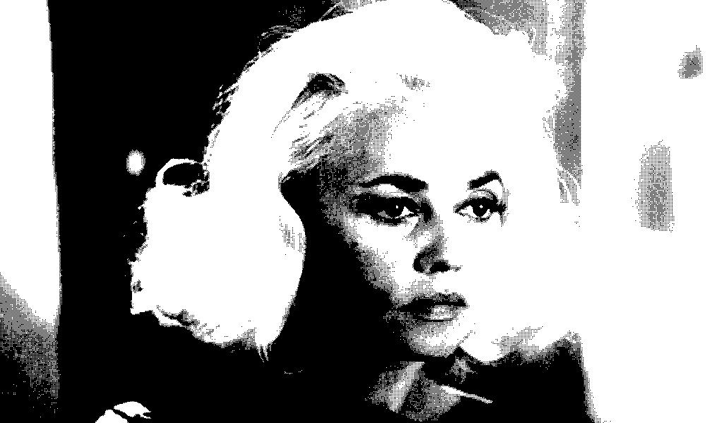

# MonokromCL



[Downoad .jar](https://github.com/fiskurgit/MonokromCL/raw/master/out/artifacts/MonokromCL_jar/MonokromCL.jar)

A command-line Java app to generate monochrome dithered images. Includes SVG export option for drawing rasters using Axidraw or other pen plotter.

```
Usage:
-d, -dither - dither algorithm (see below)
-s, -source - path to source image
-t, -target - path to save file
-th, -threshold - default is 128
-svg - output to SVG
?, -help - display this help

Available dither types:
  ordered2By2Bayer
  ordered3By3Bayer
  ordered4By4Bayer
  ordered8By8Bayer
  floydSteinberg
  jarvisJudiceNinke
  sierra
  twoRowSierra
  sierraLite
  atkinson
  stucki
  burkes
  falseFloydSteinberg
  simpleLeftToRightErrorDiffusion
  randomDithering
  simpleThreshold
```

## Examples

You'll need [Java installed](https://java.com/download):

* `java -jar MonokromCL.jar -help` - displays above help
* `java -jar MonokromCL.jar  -source /path/to/image.jpg -dither ordered2By2Bayer` - creates /path/to/image_dithered_####.jpg where #### is a timestemp in milliseconds using the ordered2By2Bayer dither method
* `java -jar MonokromCL.jar  -source /path/to/image.jpg -dither atkinson -th 155 -svg` - process source image using the atkinson dither method with threshold 155 then export as SVG to /path/to/image_svg_####.svg
* `java -jar MonokromCL.jar  -source /path/to/image.jpg -target /path/to/ditheredimage.jpg  -dither sierra` - specifying output image file
